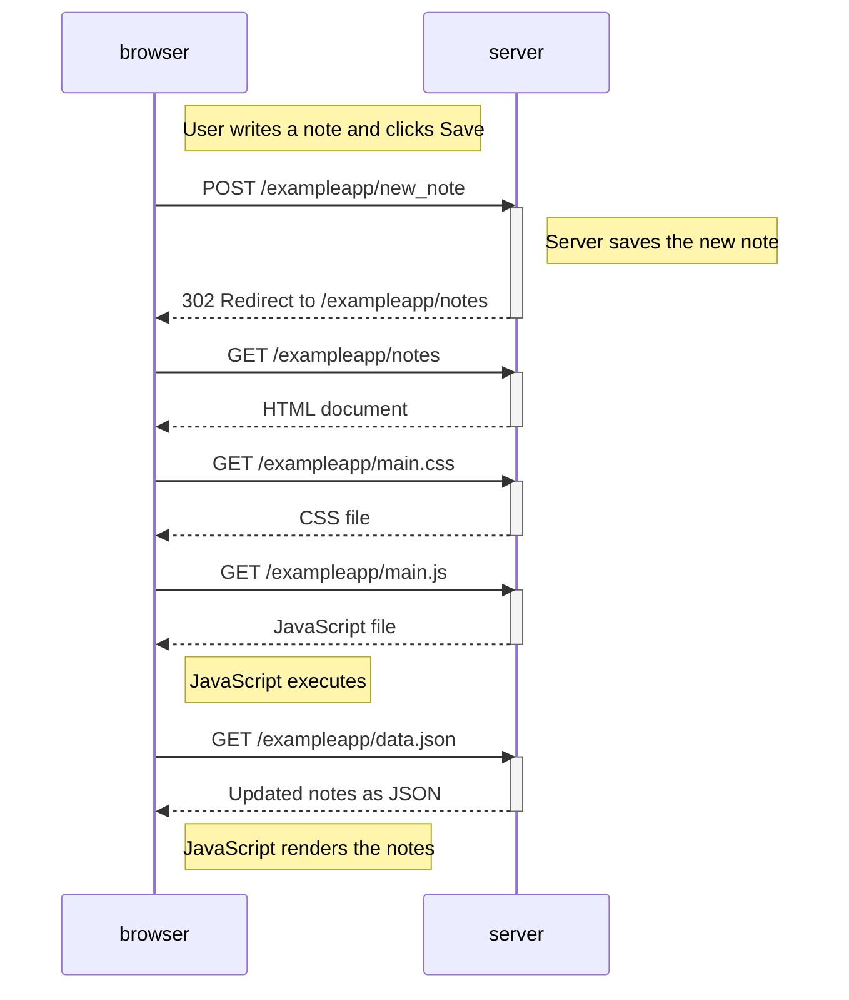

```mermaid
sequenceDiagram
    participant browser
    participant server

    Note right of browser: User writes a note and clicks Save

    browser->>server: POST /exampleapp/new_note
    activate server
    Note right of server: Server saves the new note
    server-->>browser: 302 Redirect to /exampleapp/notes
    deactivate server

    browser->>server: GET /exampleapp/notes
    activate server
    server-->>browser: HTML document
    deactivate server

    browser->>server: GET /exampleapp/main.css
    activate server
    server-->>browser: CSS file
    deactivate server

    browser->>server: GET /exampleapp/main.js
    activate server
    server-->>browser: JavaScript file
    deactivate server

    Note right of browser: JavaScript executes

    browser->>server: GET /exampleapp/data.json
    activate server
    server-->>browser: Updated notes as JSON
    deactivate server

    Note right of browser: JavaScript renders the notes
```
