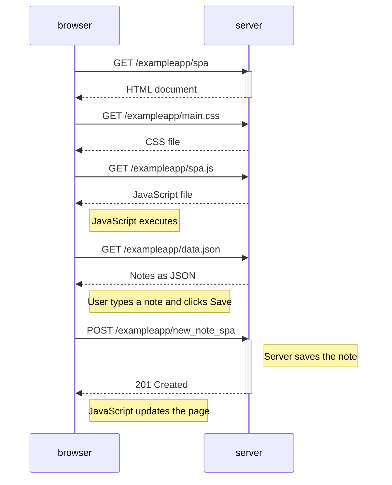

```mermaid
sequenceDiagram
    participant browser
    participant server

    browser->>server: GET /exampleapp/spa
    activate server
    server-->>browser: HTML document
    deactivate server

    browser->>server: GET /exampleapp/main.css
    server-->>browser: CSS file

    browser->>server: GET /exampleapp/spa.js
    server-->>browser: JavaScript file

    Note right of browser: JavaScript executes

    browser->>server: GET /exampleapp/data.json
    server-->>browser: Notes as JSON

    Note right of browser: User types a note and clicks Save

    browser->>server: POST /exampleapp/new_note_spa
    activate server
    Note right of server: Server saves the note
    server-->>browser: 201 Created
    deactivate server

    Note right of browser: JavaScript updates the page
```