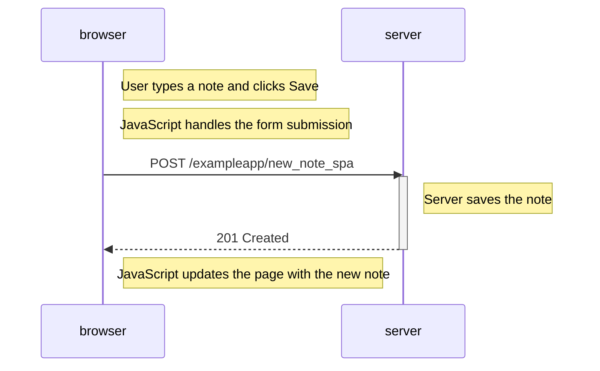

```mermaid
sequenceDiagram
    participant browser
    participant server

    Note right of browser: User types a note and clicks Save

    Note right of browser: JavaScript handles the form submission

    browser->>server: POST /exampleapp/new_note_spa
    activate server
    Note right of server: Server saves the note
    server-->>browser: 201 Created
    deactivate server

    Note right of browser: JavaScript updates the page with the new note
```